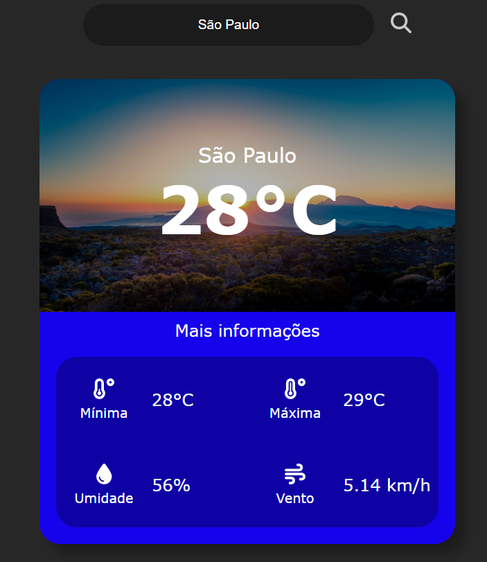

[TYPESCRIPT__BADGE]: https://img.shields.io/badge/typescript-D4FAFF?style=for-the-badge&logo=typescript
[ANGULAR__BADGE]: https://img.shields.io/badge/Angular-red?style=for-the-badge&logo=angular
[PROJECT__BADGE]: https://img.shields.io/badge/📱Visit_this_project-000?style=for-the-badge&logo=project
[PROJECT__URL]: https://github

<h1 align="center" style="font-weight: bold;">Weather App 💻</h1>

![angular][ANGULAR__BADGE]
![typescript][TYPESCRIPT__BADGE]

<p align="center">
 <a href="#about">Sobre</a> • 
 <a href="#started">Começando</a> • 
  <a href="#started">Rotas do App</a> • 
</p>

<p align="center">
    
</p>

<h2 id="about">📌 Sobre</h2>

Este é um aplicativo de previsão do tempo desenvolvido em Angular. O aplicativo permite que os usuários busquem informações meteorológicas de diferentes cidades usando a API do OpenWeatherMap.

<h4>Funcionalidades</h4>

<b>Busca de Previsão do Tempo:</b>
Os usuários podem inserir o nome de uma cidade e obter informações meteorológicas atualizadas, como temperatura, umidade e condições climáticas.

<b>Interface Responsiva:</b>
A interface do usuário é responsiva e se adapta a diferentes tamanhos de tela, garantindo uma boa experiência em dispositivos móveis e desktops.

<b>Ícones de Busca:</b>
Inclui ícones de busca para melhorar a experiência do usuário.


<h4>Tecnologias Utilizadas</h4>

- <b>Angular:</b> Framework principal para desenvolvimento do frontend.

- <b>RxJS:</b> Biblioteca para programação reativa, utilizada para gerenciar requisições assíncronas.

- <b>OpenWeatherMap API:</b> API utilizada para obter dados meteorológicos.

- <b>SCSS:</b> Pré-processador CSS utilizado para estilização.

[![project][PROJECT__BADGE]][PROJECT__URL]

<h2 id="started">🚀 Começando</h2>

<h3>Pré-requisitos</h3>

- [NodeJS](https://nodejs.org/)
- [Git](https://git-scm.com/)
- [Angular CLI](https://angular.io/cli)

<h3>Clonando</h3>

```bash
git clone https://github.com/JoaoPedro019/weather
```

<h3>Iniciando</h3>

```bash
cd weather-app
npm install
ng serve
```

<h2 id="routes">📍 Rotas da Aplicação</h2>

| rota               | descrição                                          
|----------------------|-----------------------------------------------------
| <kbd>/weather</kbd>     | página com card de informções climaticas e uma barra de pesquisa
